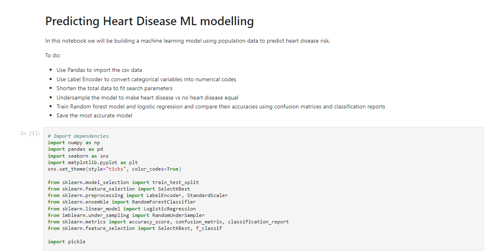
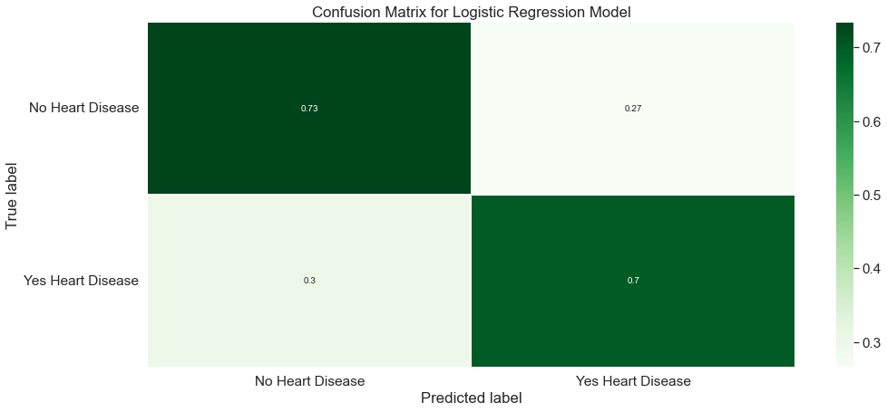
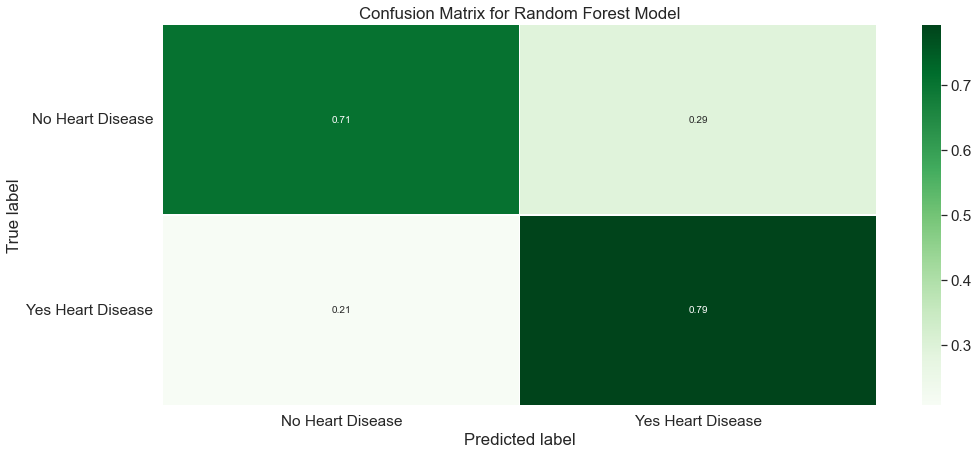
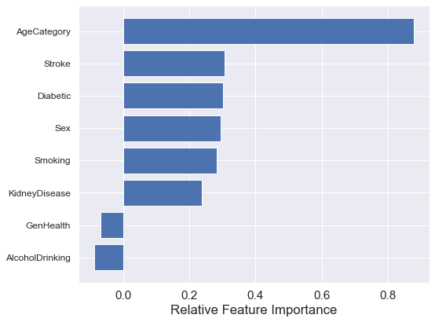
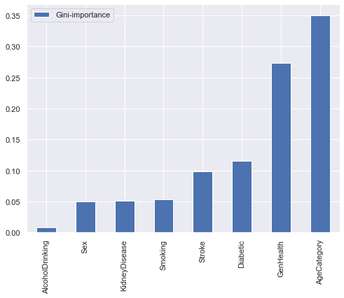
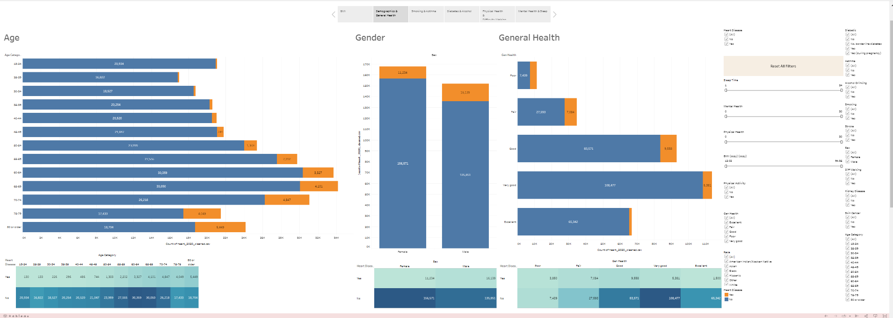
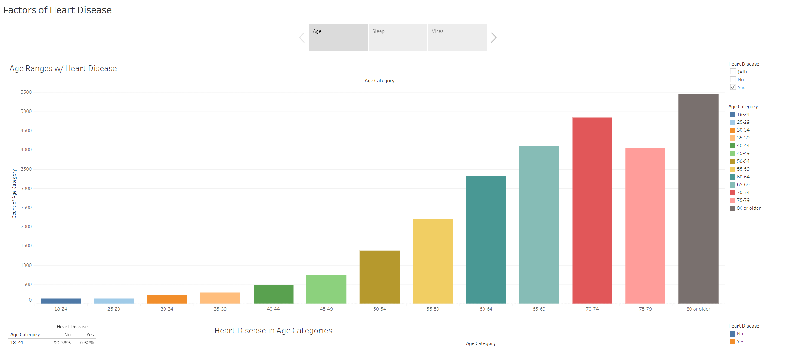
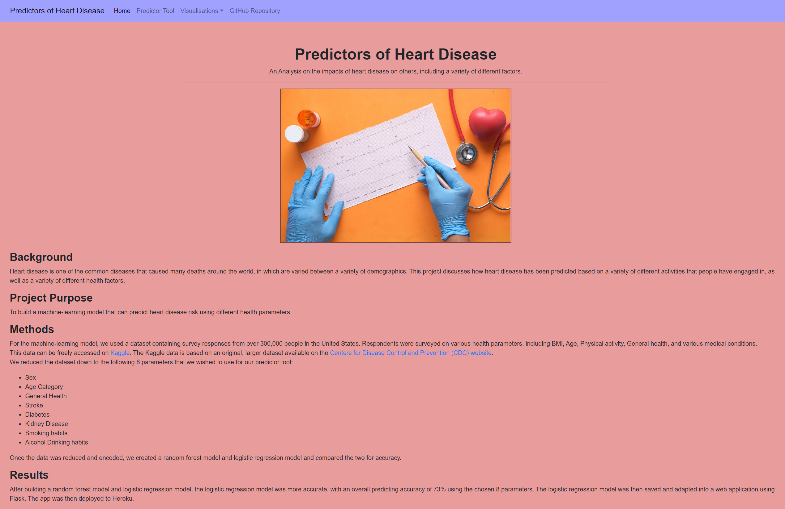
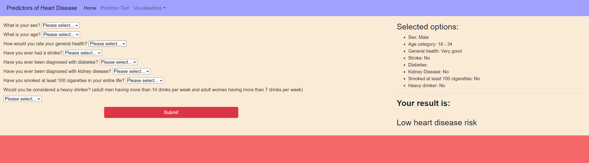

# Heart Condition Checker
The app created with Python to predict person's heart health condition based on well-trained machine learning model ().

## Table of Contents
1. [General info](#general-info)
2. [Techniques Used](#software-used)
    1. Python
    2. Tableau
    3. HTML/CSS
    4. Heroku
3. [Machine Learning](#machine-learning)
4. [Visualisation](#visualisation)
5. [Web App Interface](#web-app-interface)

## General info
In this project, we utilised a large health dataset to build and compare machine learning models in their ability to predict heart disease using a range of health parameters. 

We downloaded a dataset from Kaggle titled [Personal Key Indicators of Heart Disease](https://www.kaggle.com/datasets/kamilpytlak/personal-key-indicators-of-heart-disease). This dataset contains a total of approximately 300,000 responses from an annual telephone survey of the health of U.S. residents undertaken in 2020. The original dataset is publicly available on the [Center for Disease Control and Prevention](https://www.cdc.gov/brfss/annual_data/annual_2020.html). This data is originally stored in SAS format and contains over 200 variables.

After building a random forest model and logistic regression model, the logistic regression model was more accurate, with an overall predicting accuracy of 73% using the chosen 8 parameters. This model was used to predict a person's risk of heart disease expressed as a dichotomous variable (heart disease: yes/no). The logistic regression model was then saved and loaded into a Flask application, which was then hosted on Heroku. The web app can be found [here.](https://project-4-heart-disease.herokuapp.com/)

## Software Used
* We used a range of python modules to build and test machine learning models, including:
  * pandas to read in the data
  * scikit-learn to build and test the machine learning models
  * pickle to save python objects
  * flask to build a web application
  * matplotlib and seaborn to visualise data
* We also completed a descriptive analysis of the dataset using Tableau visualisation software
* We used HTML and CSS to build webpages to host our visualisations and our predictor tool
* We then deployed our application to Heroku.

## Machine Learning

### Choosing a model
Since we wanted to classify whether someone had heart disease or not (classification), we used Logistic Regression and Random Forest Classification.

Overall, our Logistic Regression had a higher accuracy than our random forest model (73% vs 71% respectively). Therefore, we decided to use the logistic regression model for our application.

### Feature Importances

A comparison of the 8 chosen features that we used in our two machine learning models shows that Age Category was the most important feature for accurate predictions:

**Logistic Regresion Model** 

**Random Forest Model**

## Visualisation
We created two story visualisations in Tableau to visualise our data in a meaningful manner. Both of these stories were embedded into HTML pages and were deployed into our Heroku app.

* Analysis 1 - https://public.tableau.com/app/profile/ramana7009/viz/FinalProject-HeartDieseasePrediction/TheStory?publish=yes 

* Analysis 2 - https://public.tableau.com/app/profile/nicholas4845/viz/Book1_16581366231650/FactorsofHeartDisease?publish=yes

## Web App Interface
We utilised HTML to build our predictor tool and display our Tableau visualisations. Each webpage features a navigation bar powered by Bootstrap. Each webpage was styled using CSS.

Our Flask app incorporated a GET/REQUEST API that allowed inputs to be collected from our predictor webpage to then run through our logistic regression model. Webpage users are able to use dropdown options to provide answers to the set questions. Once users press "Submit", the predictor tool will tell them whether or not they are at risk of heart disease based on their answers. For reference, the user's answers are also displayed on the prediction page above the result.

